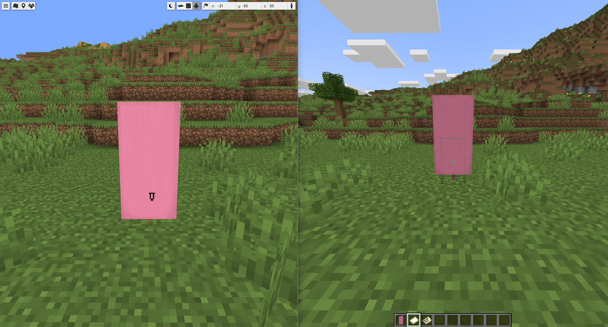

# BlueMap Banners

[](https://modrinth.com/mod/bluemap-banners)
[](https://modrinth.com/mod/bluemap-banners)


A Minecraft Fabric mod that supports displaying Minecraft banners as markers on [BlueMap](https://github.com/BlueMap-Minecraft/BlueMap).  
This is a continuation of [Banners4BM](https://github.com/Nincodedo/Banners4BM) originally by Nincodedo.



## Player usage
This mod supports custom-named banners. (Just like the vanilla feature of banners on map items.)  
Renamed banners are shown with the customized name on BlueMap as a POI marker.

### When using a map item on an existing banner (enabled by default)
* Players can use map items on banners to create the marker on BlueMap.  
* Players can use map items on banners to remove the marker.  

### When using direct placing of banners (disabled by default)
* Players place banners and markers are instantaneously created.

### Other interactions (always enabled)
* Players can break the banner by hand to remove the marker.  
* External sources can break banners to remove the marker. (TNT, support block broken)

## Commands
The main command is `/bluemapbanners`, but there is also the alias `/bb` you can use.
```
/bluemapbanners
/bluemapbanners notifyPlayerOnBannerPlace [true|false]
/bluemapbanners notifyPlayerOnMarkerAdd [true|false]
/bluemapbanners notifyPlayerOnMarkerRemove [true|false]
/bluemapbanners notifyGlobalOnMarkerRemove [true|false]
/bluemapbanners markerAddInstantOnBannerPlace [true|false]
/bluemapbanners markerAddWithOriginalName [true|false]
/bluemapbanners markerMaxViewDistance [<number>] 
/bluemapbanners bluemapUrl [<url>]
```

## Config file
``` properties
# Wheter players should be notified and introduced how to add markers to BlueMap
notifyPlayerOnBannerPlace=true

# Wheter players should be notified if they add a marker
notifyPlayerOnMarkerAdd=true

# Wheter players should be notified if they remove a marker
notifyPlayerOnMarkerRemove=true

# Wheter all players on the server should be notified a banner has been removed
notifyGlobalOnMarkerRemove=false

# Wheter markers are created instantaneously on banner place
markerAddInstantOnBannerPlace=false

# Wheter instantly created markers with an original unchanged name are added
markerAddWithOriginalName=false

# For how far you want to be able to see these banners on BlueMap
markerMaxViewDistance=10000000

# Your url on which players can click in notifications, to your BlueMap instance 
bluemapUrl=https://your-url-to-bluemap.com/

# Wheter this mod sends some usage metrics, a metric looks like: (fabric, 1.21.11, 2.2.3)
# These metrics include which server implementation, Minecraft version and mod version you are using
sendMetrics=true
```


